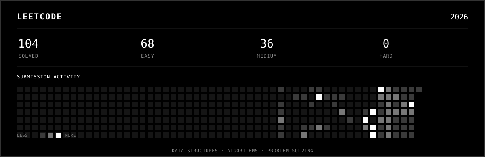

<div align="center">

# Vardhan Keerthi

<a href="https://github.com/VijayVardhan-Dev">
  
</a>
&nbsp;
<a href="https://www.linkedin.com/in/keerthi-vardhan-53a53436b">
  
</a>
&nbsp;
<a href="mailto:vardhankeerthi.dev@gmail.com">
  
</a>

<br><br>
</div>

<table align="center" width="100%" >
<tr>

<td width="62%" valign="middle">
<h2>About</h2>

<p>
I enjoy building things that solve an actual problem. I spend a lot of time
coding, learning by breaking things, and figuring out how they work rather
than just making them work once.
</p>

<p>
Right now, most of my attention is split between building projects,
improving at DSA, and experimenting with AI.
</p>


</td>

<td width="38%" align="center" valign="middle" >


</td>

</tr>
</table>

<br>
<p align="center">
  
</p>

<br>
---

## LeetCode

<p align="center">
  
</p>

---

## Projects

### AgroNet

A digital agriculture platform designed to provide useful tools and services for farmers.

* Built a cross-platform application focused on real-world agricultural use cases
* Implemented **secure image upload and storage**
* Integrated **Firebase and Node.js** for application functionality
* Working toward an extensible architecture for future AI-powered features

`Flutter` `Firebase` `Node.js` `AI`

<br/>

### AptConnect

A platform built around connecting users with useful services through a simple digital experience.

* Developed the application with a focus on **clean and practical UX**
* Implemented backend functionality and data handling
* Integrated cloud-based services for application features
* Designed the architecture with future scalability in mind

`Flutter` `Firebase` `Node.js`

<br/>

### AniVault

Anime discovery and streaming platform with search, trending content, and anime information.

`React` `Vite` `Tailwind CSS` `REST APIs`

<a href="https://anivault1.vercel.app">
  
</a>

---

## GitHub

<div align="center">


</div>

---

## Ask Me

```text
┌─────────────────────────────────────────────┐
│ vardhan@github ~ $ ./about                   │
└─────────────────────────────────────────────┘
```

<details>
<summary><code>whoami</code></summary>

Developer focused on application development, DSA, and AI projects.

</details>

<details>
<summary><code>what-am-i-learning</code></summary>

DSA, backend development, system design, and AI.

</details>

<details>
<summary><code>what-do-i-build</code></summary>

Web applications, mobile applications, cross-platform software, and AI-powered projects.

</details>

<details>
<summary><code>what-is-the-goal</code></summary>

Become a strong software engineer by combining problem solving with real-world development.

</details>

<details>
<summary><code>contact</code></summary>

Email: [vardhankeerthi.dev@gmail.com](mailto:vardhankeerthi.dev@gmail.com)

LinkedIn: [Vardhan Keerthi](https://www.linkedin.com/in/keerthi-vardhan-53a53436b)

</details>

```text
vardhan@github ~ $ _
```

---

<div align="center">

<a href="https://github.com/VijayVardhan-Dev">
  
</a>

<br/><br/>


</div>
